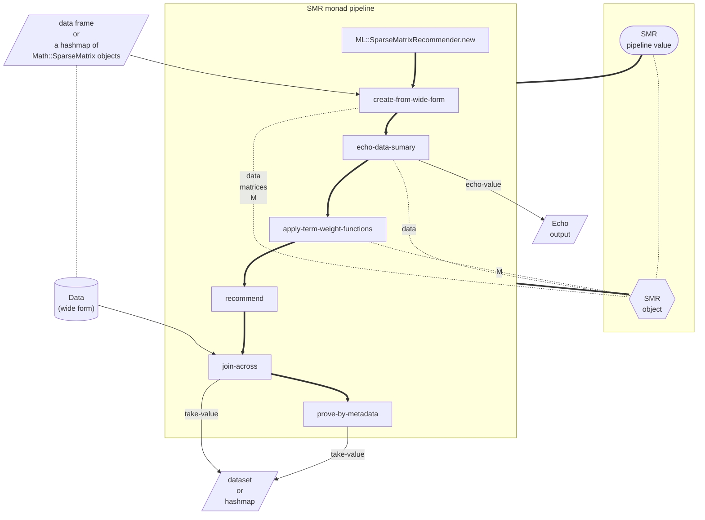

# Sparse Matrix Recommender (SMR) Raku package

[](https://github.com/antononcube/Raku-ML-SparseMatrixRecommender/actions)
[](https://github.com/antononcube/Raku-ML-SparseMatrixRecommender/actions)
[](https://github.com/antononcube/Raku-ML-SparseMatrixRecommender/actions)

[](https://raku.land/zef:antononcube/ML::SparseMatrixRecommender)
[](https://opensource.org/licenses/Artistic-2.0)

## Introduction

This Raku package, "ML::SparseMatrixRecommender", has different functions for computations of recommendations
based on (user) profile or history using Sparse Linear Algebra (SLA). The package mirrors
the Wolfram Language (WL) implementation, [AAp1].
There are also corresponding implementations in Python and R; see [AAp6, AAp2].

The package is based on a certain "standard" Information retrieval paradigm -- it utilizes
Latent Semantic Indexing (LSI) functions like IDF, TF-IDF, etc. Hence, the package also has
document-term matrix creation functions and LSI application functions. I included them in the
package since I wanted to minimize the external package dependencies.

The package includes the data-set `dfTitanic` in order to make easier the
writing of introductory examples and unit tests.

For more theoretical description see the article
["Mapping Sparse Matrix Recommender to Streams Blending Recommender"](https://github.com/antononcube/MathematicaForPrediction/blob/master/Documentation/MappingSMRtoSBR/Mapping-Sparse-Matrix-Recommender-to-Streams-Blending-Recommender.pdf)
, [AA1].

For detailed examples see the files
["Basic-usage.raku"](https://github.com/antononcube/Raku-ML-SparseMatrixRecommender/blob/main/examples/Basic-usage.raku)
and
["Classification.raku"](https://github.com/antononcube/Raku-ML-SparseMatrixRecommender/blob/main/examples/Classification.raku),
and the Jupyter notebooks in the GitHub repository ["./docs"](https://github.com/antononcube/Raku-ML-SparseMatrixRecommender/tree/main/docs) folder.


**Remark:** "SMR" stands for "Sparse Matrix Recommender". Most of the operations of this Raku package
mirror the operations of the software monads "MonadicSparseMatrixRecommender", "SMRMon-R", [AAp1, AAp2] and 
the attributes and methods of the Python package [AAp7].

------

## Workflows

Here is a diagram that encompasses the workflows this package supports (or will support):

[](https://github.com/antononcube/SimplifiedMachineLearningWorkflows-book/raw/master/Part-2-Monadic-Workflows/Diagrams/A-monad-for-Sparse-Matrix-Recommender-workflows/SMR-workflows.pdf)

Here is a narration of a certain workflow scenario:

1. Get a dataset.
2. Create contingency matrices for a given identifier column and a set of "tag type" columns.
3. Examine recommender matrix statistics.
4. If the assumptions about the data hold apply LSI functions.
    - For example, the "usual trio" IDF, Frequency, Cosine.
5. Do (verify) example profile recommendations.
6. If satisfactory results are obtained use the recommender as a nearest neighbors classifier.


------

## Monadic design

Here is a diagram of typical pipeline building using a `ML::SparseMatrixRecommender` object:



**Remark:** The **monadic design** allows "pipelining" of the SMR operations -- see the usage example section.


------

## Installation

To install from GitHub use the shell command:

```
zef install https://github.com/antononcube/Raku-ML-SparseMatrixRecommender
```

To install from [Zef ecosystem](https://raku.land):

```
zef install ML::SparseMatrixRecommender
``` 


------

## Usage example

Here is an example of an SMR pipeline for creation of a recommender
over Titanic data and recommendations for the profile "passengerSex:male" and "passengerClass:1st":

```raku
use ML::SparseMatrixRecommender;
use ML::SparseMatrixRecommender::Utilities;

my @dsTitanic = ML::SparseMatrixRecommender::Utilities::get-titanic-dataset();

my $smrObj = 
        ML::SparseMatrixRecommender
        .new
        .create-from-wide-form(
                @dsTitanic,
                tag-types => Whatever,
                item-column-came => <id>)
        .apply-term-weight-functions('IDF', 'None', 'Cosine')
        .recommend-by-profile(["passengerSex:male", "passengerClass:1st"], 10, :!normalize)
        .echo-value('recommendation by profile: ');
```

**Remark:** More examples can be found in the directory
["./docs"](https://github.com/antononcube/Raku-ML-SparseMatrixRecommender/docs).

-----

## Related Python packages

The Python package
["SparseMatrixRecommender"](https://github.com/antononcube/Python-packages/tree/main/SparseMatrixRecommender),
[AAp6], implements a software monad for SMR workflows.

The Python package
["LatentSemanticAnalyzer"](https://github.com/antononcube/Python-packages/tree/main/LatentSemanticAnalyzer),
[AAp7], can be used to make matrices for "SparseMatrixRecommender".

The Python package 
["SSparseMatrix"](https://github.com/antononcube/Python-packages/tree/main/SSparseMatrix), [AAp6],
is fundamental in both "SparseMatrixRecommender" and "LatentSemanticAnalyzer". 
"SSparseMatrix" corresponds to the Raku package ["Math::SparseMatrix"](https://github.com/antononcube/Raku-Math-SparseMatrix), [AAp9],
which is fundamental for this package.  

Here is the Python "SparseMatrixRecommender" pipeline that corresponds to the Raku pipeline above:

```python
from SparseMatrixRecommender.SparseMatrixRecommender import *
from SparseMatrixRecommender.DataLoaders import *

dfTitanic = load_titanic_data_frame()

smrObj = (SparseMatrixRecommender()
          .create_from_wide_form(data = dfTitanic, 
                                 item_column_name="id", 
                                 columns=None, 
                                 add_tag_types_to_column_names=True, 
                                 tag_value_separator=":")
          .apply_term_weight_functions(global_weight_func = "IDF", 
                                       local_weight_func = "None", 
                                       normalizer_func = "Cosine")
          .recommend_by_profile(profile=["passengerSex:male", "passengerClass:1st"], 
                                nrecs=12)
          .join_across(data=dfTitanic, on="id")
          .echo_value())
```

-----

## Related R packages

The package
["SMRMon-R"](https://github.com/antononcube/R-packages/tree/master/SMRMon-R),
[AAp2], implements a software monad for SMR workflows.
Most of "SMRMon-R" functions delegate to `SparseMatrixRecommender", [AAp3].

The package
["SparseMatrixRecommenderInterfaces"](https://github.com/antononcube/R-packages/tree/master/SparseMatrixRecommenderInterfaces),
[AAp4], provides functions for interactive
[Shiny](https://shiny.rstudio.com)
interfaces for the recommenders made with "SparseMatrixRecommender" and/or "SMRMon-R".

The package
["LSAMon-R"](https://github.com/antononcube/R-packages/tree/master/LSAMon-R),
[AAp5], can be used to make matrices for "SparseMatrixRecommender" and/or "SMRMon-R".

Here is the "SMRMon-R" pipeline that corresponds to the Raku pipeline above:

```r
smrObj <-
  SMRMonCreate( data = dfTitanic, 
                itemColumnName = "id", 
                addTagTypesToColumnNamesQ = TRUE, 
                sep = ":") %>%
  SMRMonApplyTermWeightFunctions(globalWeightFunction = "IDF", 
                                 localWeightFunction = "None", 
                                 normalizerFunction = "Cosine") %>%
  SMRMonRecommendByProfile( profile = c("passengerSex:male", "passengerClass:1st"), 
                            nrecs = 12) %>%
  SMRMonJoinAcross( data = dfTitanic, by = "id") %>%
  SMRMonEchoValue
```

------

## Related Wolfram Language packages

The Wolfram Language (WL) software monad
["MonadicSparseMatrixRecommender"](https://resources.wolframcloud.com/PacletRepository/resources/AntonAntonov/MonadicSparseMatrixRecommender/), [AAp1], 
provides recommendation pipelines similar to the pipelines created with this package.

Here is a WL monadic pipeline that corresponds to the Raku pipeline above:

```mathematica
smrObj =
  SMRMonUnit[]⟹
   SMRMonCreate[dfTitanic, "id", 
                "AddTagTypesToColumnNames" -> True, 
                "TagValueSeparator" -> ":"]⟹
   SMRMonApplyTermWeightFunctions["IDF", "None", "Cosine"]⟹
   SMRMonRecommendByProfile[{"passengerSex:male", "passengerClass:1st"}, 12]⟹
   SMRMonJoinAcross[dfTitanic, "id"]⟹
   SMRMonEchoValue[];   
```

*(Compare the pipeline diagram above with the
[corresponding diagram using Mathematica notation](https://github.com/antononcube/SimplifiedMachineLearningWorkflows-book/raw/master/Part-2-Monadic-Workflows/Diagrams/A-monad-for-Recommender-workflows/SMRMon-pipeline.jpeg)
.)*


------

## Recommender comparison project

The project repository "Scalable Recommender Framework", [AAr1],
has documents, diagrams, tests, and benchmarks of a recommender system implemented in multiple programming languages.

This Python recommender package is a decisive winner in the comparison -- see the first 10 min of
the video recording [AAv1] or the benchmarks at [AAr1].

------

## Code generation with natural language commands

### Using grammar-based interpreters

The project "Raku for Prediction", [AAr2, AAv2, AAp7], has a Domain Specific Language (DSL) grammar and interpreters
that generate SMR code for the corresponding Mathematica, Python, R, and Raku packages, [AAp10].

Here is Command Line Interface (CLI) invocation example that generate code for this package:

```shell
ToRecommenderWorkflowCode Raku 'create with dfTitanic; apply the LSI functions IDF, None, Cosine;recommend by profile 1st and male' 
```

### NLP Template Engine

Here is an example using the NLP Template Engine, [AAp11, AAr2, AAv3], (which uses LLMs to fill in static templates):

```raku
use ML::NLPTemplateEngine;
'create recommender with dfTitanic; apply the LSI functions IDF, None, Cosine;recommend by profile 1st and male' 
==> concretize(lang => "Raku")
```

### By DSL examples

Instead of using grammars the individual commands translation can be done using LLMs and few-shot training examples,
see ["DSL::Examples"](https://raku.land/zef:antononcube/DSL::Examples), [AAp12]. Here is an example:

```raku
use DSL::Examples;
use LLM::Functions;
my &llm-pipeline-segment = llm-example-function(dsl-examples()<Raku><SMRMon>);

my $spec = q:to/END/;
new recommender;
create from @dsData; 
apply LSI functions IDF, None, Cosine; 
recommend by profile for passengerSex:male, and passengerClass:1st;
join across with @dsData on "id";
echo the pipeline value;
classify by profile passengerSex:female, and passengerClass:1st on the tag passengerSurvival;
echo value
END

my @commands = $spec.lines;

@commands
        .map({ .&llm-pipeline-segment })
        .map({ .subst(/:i Output \h* ':'?/, :g).trim })
        .join("\n.")
```

------

## Performance

The package versions less than 0.1.0 do not use the fastest sparse matrix multiplications. 
(Based on "NativeCall", i.e. "Math::SparseMatrix::Native".)
The reason for this is that I am not sure what is the best design. Here are my considerations:

- The "native" calculations should be switched on and off.
  - Useful for comparison, tracing, and testing purposes.
- It is not clear to me where the native computations should be specified/invoked:
  1. Should the native coercion be implemented at "Math::SparseMatrix" level?
    - I.e. if one of the multiplier is native the other is turned into native too.
  2. Should "Math::SparseMatrixRecommender" decide on "native or not" depending on the matrices and a flag?
- The filtering out of recommendation history is currently too slow.
  - Currently, sparse elementwise multiplication is used. 
  - There are several alternatives to _try out_ (and see which is faster.)


------

## References

### Articles

[AA1] Anton Antonov,
["Mapping Sparse Matrix Recommender to Streams Blending Recommender"](https://github.com/antononcube/MathematicaForPrediction/blob/master/Documentation/MappingSMRtoSBR/Mapping-Sparse-Matrix-Recommender-to-Streams-Blending-Recommender.pdf)
(2017),
[MathematicaForPrediction at GitHub](https://github.com/antononcube/MathematicaForPrediction).

### Mathematica / Wolfram Language (WL)

[AAp1] Anton Antonov,
[MonadicSparseMatrixRecommender, WL paclet](https://resources.wolframcloud.com/PacletRepository/resources/AntonAntonov/MonadicSparseMatrixRecommender/),
(2018-2024),
[Wolfram Language Paclet Repository](https://resources.wolframcloud.com/PacletRepository/).

### R packages

[AAp2] Anton Antonov,
[SMRMon, R package](https://github.com/antononcube/R-packages/tree/master/SMRMon-R)
(2019-2024),
[R-packages at GitHub/antononcube](https://github.com/antononcube/R-packages).

[AAp3] Anton Antonov,
[SparseMatrixRecommender, R package](https://github.com/antononcube/R-packages/tree/master/SparseMatrixRecommender)
(2019-2024),
[R-packages at GitHub/antononcube](https://github.com/antononcube/R-packages).

[AAp4] Anton Antonov,
[Sparse Matrix Recommender framework interface functions](https://github.com/antononcube/R-packages/tree/master/SparseMatrixRecommenderInterfaces)
(2019),
[R-packages at GitHub/antononcube](https://github.com/antononcube/R-packages).

[AAp5] Anton Antonov,
[LSAMon, R package](https://github.com/antononcube/R-packages/tree/master/LSAMon-R)
(2019),
[R-packages at GitHub/antononcube](https://github.com/antononcube/R-packages).

### Python packages

[AAp6] Anton Antonov,
[SSparseMatrix, Python package](https://github.com/antononcube/Python-packages/tree/master/SSparseMatrix)
(2021),
[Python-packages at GitHub/antononcube](https://github.com/antononcube/Python-packages).

[AAp7] Anton Antonov,
[SparseMatrixRecommender, Python package](https://github.com/antononcube/Python-packages/tree/master/SparseMatrixRecommender)
(2021),
[Python-packages at GitHub/antononcube](https://github.com/antononcube/Python-packages).

[AAp8] Anton Antonov,
[LatentSemanticAnalyzer, Python package](https://github.com/antononcube/Python-packages/tree/main/LatentSemanticAnalyzer)
(2021),
[Python-packages at GitHub/antononcube](https://github.com/antononcube/Python-packages).

### Raku packages

[AAp9] Anton Antonov,
[Math::SparseMatrix, Raku package](https://github.com/antononcube/Raku-Math-SparseMatrix),
(2024-2025),
[GitHub/antononcube](https://github.com/antononcube).
([At raku.land](https://raku.land/zef:antononcube/Math::SparseMatrix)).

[AAp10] Anton Antonov,
[DSL::English::RecommenderWorkflows, Raku package](https://github.com/antononcube/Raku-DSL-English-RecommenderWorkflows),
(2018-2022),
[GitHub/antononcube](https://github.com/antononcube).
([At raku.land](https://raku.land/zef:antononcube/DSL::English::RecommenderWorkflows)).

[AAp11] Anton Antonov,
[ML::NLPTemplateEngine, Raku package](https://github.com/antononcube/Raku-ML-NLPTemplateEngine),
(2023-2025),
[GitHub/antononcube](https://github.com/antononcube).
([At raku.land](https://raku.land/zef:antononcube/ML::NLPTemplateEngine)).

[AAp12] Anton Antonov,
[DSL::Examples, Raku package](https://github.com/antononcube/Raku-DSL-Examples),
(2024-2025),
[GitHub/antononcube](https://github.com/antononcube).
([At raku.land](https://raku.land/zef:antononcube/DSL::Examples)).

### Repositories

[AAr1] Anton Antonov,
[Scalable Recommender Framework project](https://github.com/antononcube/Scalable-Recommender-Framework-project),
(2022)
[GitHub/antononcube](https://github.com/antononcube).

[AAr2] Anton Antonov,
["Raku for Prediction" book project](https://github.com/antononcube/RakuForPrediction-book),
(2021-2022),
[GitHub/antononcube](https://github.com/antononcube).

### Videos

[AAv1] Anton Antonov,
["TRC 2022 Implementation of ML algorithms in Raku"](https://www.youtube.com/watch?v=efRHfjYebs4),
(2022),
[Anton A. Antonov's channel at YouTube](https://www.youtube.com/channel/UC5qMPIsJeztfARXWdIw3Xzw).

[AAv2] Anton Antonov,
["Raku for Prediction"](https://www.youtube.com/watch?v=frpCBjbQtnA),
(2021),
[The Raku Conference (TRC) at YouTube](https://www.youtube.com/channel/UCnKoF-TknjGtFIpU3Bc_jUA).

[AAv3] Anton Antonov,
["NLP Template Engine, Part 1"](https://www.youtube.com/watch?v=a6PvmZnvF9I),
(2021),
[Anton A. Antonov's channel at YouTube](https://www.youtube.com/channel/UC5qMPIsJeztfARXWdIw3Xzw).
